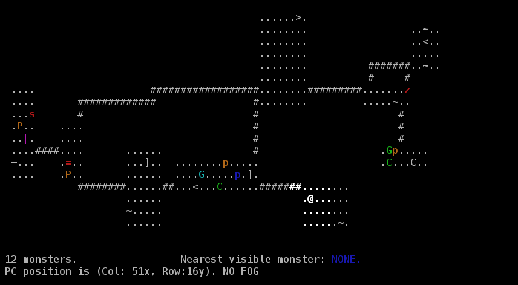

# Rogue-Like Game

**1. Purpose**
* A rogue-like game written in C/C++.  [more info] (https://en.wikipedia.org/wiki/Roguelike)

**2. Environment**
* Written for a Linux Distribution.

**3. Algorithms used & Libraries**
* Dijkstra's algorithm for all Path Finding capabilities.
* Random Algorithm for Level Generation
* Ncurses Library for display

**4. Operating instructions**
* '>make'
	*  terminal command. Which will produce an executable 'rlg'
* '>./rlg'
	* terminal command

**5. Options**
* -s/-l
	* Saving/Loading
* -'<file>'
	* File parsing for specific monsters/bosses creation

<!-- [Note to self](https://github.com/wasartin/rogueLikeGame/tree/75b6fffebe8c08907eecab654676574e27840ee5 "Last pure C commit") -->
